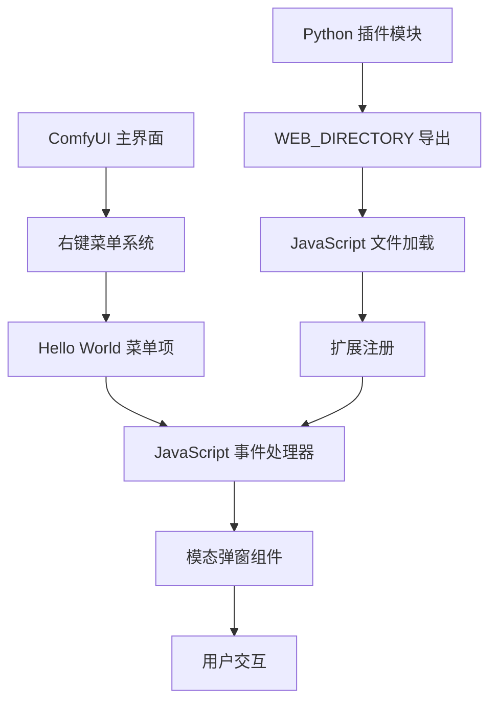
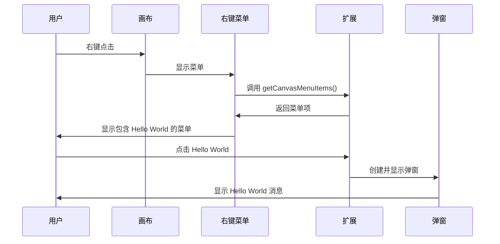

# Design Document

## Overview

本设计文档描述了如何在现有的 ComfyUI 插件项目中实现一个前端扩展，该扩展将在右键菜单中添加一个 "Hello World" 选项，点击后弹出一个简单的模态对话框。

## Architecture

### 整体架构



### 技术架构

本项目采用 ComfyUI 的标准前端扩展架构：

1. **Python 层**: 通过 `__init__.py` 导出 `WEB_DIRECTORY`
2. **JavaScript 层**: 实现前端扩展逻辑
3. **UI 层**: 集成到 ComfyUI 的右键菜单系统

## Core Components

### 1. Python 模块配置

#### WEB_DIRECTORY 导出
- **位置**: `__init__.py` 文件
- **功能**: 指定前端 JavaScript 文件的目录
- **实现**: 添加 `WEB_DIRECTORY = "./web"` 到现有的 `__init__.py`

### 2. JavaScript 扩展

#### 扩展注册模块
- **文件**: `web/hello_world_modal.js`
- **功能**: 注册 ComfyUI 扩展并添加右键菜单项
- **核心方法**: 
  - `getCanvasMenuItems()`: 添加菜单项到右键菜单
  - `showHelloWorldModal()`: 显示模态弹窗

#### 模态弹窗组件
- **实现方式**: 原生 JavaScript + CSS
- **功能特性**:
  - 居中显示
  - 半透明背景遮罩
  - 响应式设计
  - 键盘事件支持 (ESC 关闭)

### 3. 用户界面集成

#### 右键菜单集成


## Detailed Design

### 1. 文件结构

```
project_root/
├── __init__.py (修改)
├── web/ (新建目录)
│   └── hello_world_modal.js (新建文件)
└── ... (现有文件)
```

### 2. JavaScript 扩展实现

#### 扩展注册
```javascript
import { app } from "../../scripts/app.js";

app.registerExtension({
    name: "design.ai.comfy.hello.world.modal",
    getCanvasMenuItems(canvas) {
        return [
            null, // 分隔线
            {
                content: "Hello World",
                callback: () => {
                    showHelloWorldModal();
                }
            }
        ];
    }
});
```

#### 模态弹窗实现
- **创建方式**: 动态创建 DOM 元素
- **样式**: 内联 CSS 样式确保独立性
- **事件处理**: 
  - 点击背景关闭
  - ESC 键关闭
  - 确定按钮关闭

### 3. 样式设计

#### 弹窗样式特性
- **背景遮罩**: `rgba(0, 0, 0, 0.5)` 半透明黑色
- **弹窗主体**: 白色背景，圆角边框，阴影效果
- **按钮样式**: ComfyUI 风格的按钮设计
- **动画效果**: 淡入淡出效果

### 4. 错误处理

#### 异常情况处理
- **扩展加载失败**: 静默失败，不影响主功能
- **DOM 操作失败**: 使用 try-catch 包装
- **事件绑定失败**: 提供降级方案

## Integration Points

### 1. 与现有插件的集成

#### Python 模块集成
- **修改点**: `__init__.py` 文件的 `__all__` 列表
- **兼容性**: 不影响现有节点注册
- **向后兼容**: 保持现有功能完整性

#### JavaScript 扩展集成
- **加载机制**: ComfyUI 自动加载 `web` 目录下的 `.js` 文件
- **命名空间**: 使用唯一的扩展名称避免冲突
- **API 使用**: 使用 ComfyUI 提供的标准扩展 API

### 2. 用户体验集成

#### 菜单集成
- **位置**: 右键菜单底部，使用分隔线区分
- **一致性**: 遵循 ComfyUI 的菜单设计规范
- **响应性**: 即时响应用户点击

## Boundary Cases and Special Scenarios

| 场景 | 处理方式 | 代码位置 |
|------|----------|----------|
| 重复点击菜单项 | 防止多个弹窗同时显示 | `hello_world_modal.js` - `showHelloWorldModal()` |
| 快速连续点击 | 添加防抖机制 | `hello_world_modal.js` - 事件处理器 |
| 浏览器兼容性 | 使用标准 DOM API | `hello_world_modal.js` - 全文件 |
| CSS 样式冲突 | 使用高优先级样式和唯一类名 | `hello_world_modal.js` - 样式定义 |
| 内存泄漏 | 正确移除事件监听器和 DOM 元素 | `hello_world_modal.js` - `closeModal()` |
| 键盘导航 | 支持 Tab 键和 ESC 键 | `hello_world_modal.js` - 键盘事件处理 |
| 移动设备适配 | 响应式设计，触摸友好 | `hello_world_modal.js` - CSS 媒体查询 |
| 扩展加载失败 | 静默失败，记录错误日志 | `hello_world_modal.js` - try-catch 块 |